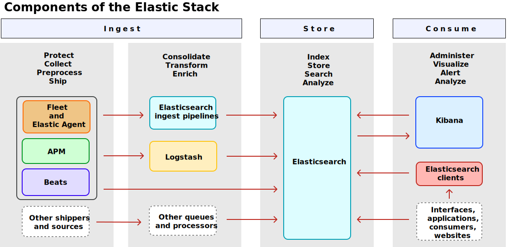

# Elastic Stack

Elastic Stack là một tập hợp các công cụ *mã nguồn mở* phục vụ chức năng *thu thập*, *lưu trữ*, *tìm kiếm*, *phân tích* và *visualize* dữ liệu theo thời gian thực (tốc độ xử lý nhanh)

- **Elasticsearch** một engine giúp tìm kiếm và phân tích dữ liệu, đóng vai trò là trung tâm lưu trữ và xử lý dữ liệu.
- **Kibana** là giao diện GUI cho Elasticsearch, giúp visualize dữ liệu và quản lý Elastic Stack.
- **Logstash** là công cụ tổng hợp, tiền xử lý và chuyển đổi dữ liệu từ nhiều hệ thống khác nhau trước khi gửi vào Elasticsearch.
- **Beats** là công cụ thu thập dữ liệu tại nguồn và gửi đến Elasticsearch (hoặc đi qua Logstash để tiền xử lý)



Trong mô hình này có thêm một số thành phần sau:
- **Elastic Agent** giúp giám sát logs, metrics và các nguồn dữ liệu khác.
- **Fleet** giúp quản lý các Elastic Agent cũng như các chính sách thu thập dữ liệu của chúng
- **APM** là hệ thống giám sát hiệu năng cho ứng dụng nguồn như thời gian phản hồi, database queries, cache,...
- **Elasticsearch client** giao diện cho phép tương tác với Elasticsearch thông qua các API.

## Installation

Ta có thể self-hosted Elastic Stack, có thể thông qua Docker hoặc trên Cloud

Script dưới đây thực hiện tạo các scripts và docker-compose.yml để deploy Elastic Stack trên Docker.

```bash
curl -fsSL https://elastic.co/start-local | sh
```
