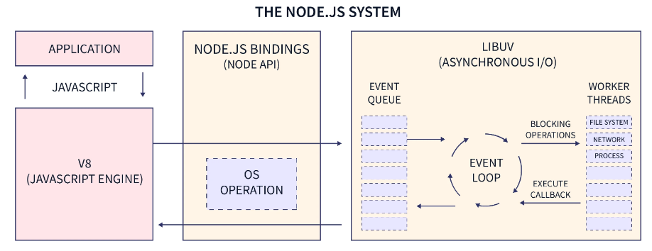
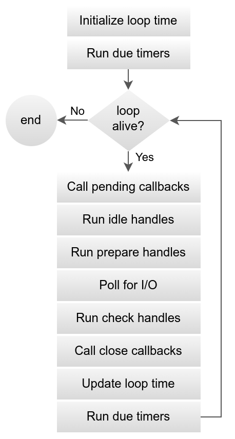
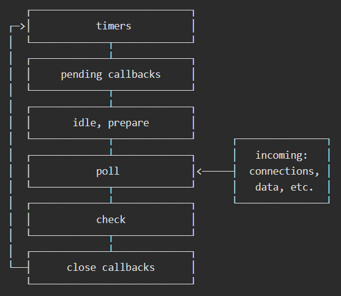

# NodeJS

NodeJS là một Framework chạy trên Google Chrome V8 Javascript Engine, dùng để phát triển ứng dụng có thể chạy Javascript ở cả Client và Server. NodeJS là một **môi trường thực thi JS** mã nguồn mở và đa nền tảng. 
- **V8** *là một Javascript Engine được sử dụng cho **Google Chrome**, dùng để thực thi JS, và điểm đặc biệt là nó tách rời với Browser (Browser sẽ triển khai thêm DOM và Web Platform APIs). Engine này hiện nay được sử dụng phổ biến cho các ứng dụng NodeJS. Ngoài ra có một số JS Engines khác như: **SpiderMonkey** (Firefox), **JavaScriptCore/Nitro** (Safari),... Tất cả các JS Engine đều triển khai theo chuẩn ECMAScript.*
- *V8 được viết bằng C++, có thể triển khai và chạy trên đa nền tảng.*
- Javascript ban đầu là một ngôn ngữ thông dịch, nhưng có một số thay đổi biến nó thành một ngôn ngữ biên dịch, với mục tiêu nhằm tăng tốc thực thi. *Phiên bản compiler đầu tiên cho JS compiler được giới thiệu vào năm 2009 trong **SpiderMonkey** Engine.* V8 cũng thực hiện compile JS với JIT (just-in-time compilation)

Một ứng dụng NodeJS chạy trên một tiến trình riêng, cung cấp **một tập các lời gọi vào ra bất đồng bộ**, không cần tạo luồng mới cho từng requests và việc truy cập vào ra cũng không bị chặn dừng. NodeJS khắc phục được nhược điểm của AJAX khi mà số lượng request tới Server là quá lớn.

Cả Browser và NodeJS đều sử dụng Javascript. Tuy nhiên, xây dựng một ứng dụng NodeJS khác hoàn toàn với tạo một ứng dụng chạy trên Browser. (1) *Trên Browser, hầu hết các tác vụ của JS là liên quan đến **tương tác với DOM và các Web Platform APIs** (như Cookies); và các chức năng này không có trên NodeJS. Ngược lại, phía NodeJS cung cấp một số chức năng như **truy xuất hệ thống tệp**, điều mà JS trên Browser không hỗ trợ.* (2) *Có thể lựa chọn ngay phiên bản JS mới nhất cho ứng dụng NodeJS nhưng một ứng dụng trên Browser lại cần phải xem xét việc tương thích với các phiên bản của Browsers, đặc biệt là quá trình nâng cấp phiên bản ES.*

Download NodeJS: https://nodejs.org/en/

## Kiến trúc

NodeJS là sự kết hợp của **Chrome's V8 JS Engine**, **Event Loop** và **IO API**.



Trong mô hình truyền thống (như Apache, Ruby Puma), các web servers dành một luồng riêng để xử lý mỗi request. Còn NodeJS được xây dựng theo kiến trúc **đơn luồng hướng sự kiện**. Cả ứng dụng web chỉ chạy trên một tiến trình, ở đó:
- Tất cả các requests được xử lý trên cùng một luồng (Single Thread)
- Tất cả các thao tác vào ra sẽ được xử lý bất đồng bộ.

Hướng thiết kế này được kế thừa từ đặc điểm của việc thực thi chương trình trên Browser: các Browser được thiết kế để thích ứng các tương tác của người dùng (ví dụ: `onClick`), NodeJS kế thừa và mở rộng điều đó với các chức năng tương tác với files, networks,...

Ứng dụng NodeJS chỉ sử dụng một số ít luồng trong hệ thống, bao gồm:
- Một luồng cho Event Loop - xử lý các yêu cầu **non-blocking I/O**.
- Mỗi luồng cho mỗi Worker - thực thi các công việc phức tạp hơn (sử dụng C++) như **blocking I/O**.

### Event Loop

NodeJS coi các thao tác vào ra là nút thắt cổ chai chính (bottleneck) và **Event Loop** hỗ trợ để thực thi chúng ở chế độ bất đồng bộ (non-blocking).

Event Loop trong NodeJS được triển khai nhờ thư viện [**libuv**](https://libuv.org/), một thư viện đa nền tảng viết bằng C, **nằm ngoài V8 Engine**. Thư viện này làm Event Loop trong NodeJS được triển khai khác với Event Loop trên Browsers.

#### Thực thi đồng bộ và Thực thi bất đồng bộ

Trong NodeJS, V8 Engine sẽ đảm nhiệm thực thi chương trình JS, nó duy trì và quản lý **Memory Heap** (chứa dữ liệu) và **Call Stack** (chứa các lời gọi hàm). 
- Các lời gọi hàm sẽ lần lượt được đẩy vào Call Stack để **thực thi đồng bộ**, và được đẩy ra khi hoàn thành.
- Khi một lời gọi hàm cần xử lý bất đồng bộ, **libuv** sẽ đảm nhiệm việc thực thi nó, nó cũng sẽ bị đẩy ra khỏi Call Stack. libuv sẽ cố gắng tận dụng cơ chế không chặn dừng mà OS hỗ trợ (ví dụ khi xử lý network requests), hoặc nếu không (như khi đọc file), nó sẽ tạo thread pool để không thực thi trên thread chính.
- Khi xử lý bất đồng bộ hoàn thành, **callback** của lời gọi bất đồng bộ sẽ được đẩy vào Call Stack để thực thi.

> *Nếu như khi lời gọi bất đồng bộ hoàn thành và các lời gọi đồng bộ vẫn chưa được thực thi xong, thời điểm nào NodeJS sẽ thực thi callbacks?*
- Chỉ khi toàn bộ chương trình **đã được thực thi** (thực thi đồng bộ) thì Event Loop mới bắt đầu. VD trong đoạn code sau đây, mặc dù `setTimeout` chỉ cần 1s để hoàn thành nhưng phải sau 4s (khi đã thực thi đồng bộ xong vòng lặp `while` ở chương trình chính), callback của nó mới được thực thi.

```js
// set function to be called after 1 second
setTimeout(function() {
   console.log('Timeout ran at ' + new Date().toTimeString());
}, 1000);

// store the start time
var start = new Date();
console.log('Enter loop at: '+start.toTimeString());

// run a loop for 4 seconds
var i = 0;
while(new Date().getTime() < start.getTime() + 4000) {
   i++;
}
console.log('Exit loop at: ' + new Date().toTimeString()
            +'. Ran ' + i + ' iterations.');
```

#### Hiểu về polling

Trong UNIX, việc tương tác với các thiết bị đều được coi như tương tác với file, một tiến trình khi muốn thực hiện vào ra thì cần sử dụng một cấu trúc gọi là **file descriptor**, kernel sẽ sử dụng thông tin này để xác định thiết bị cần tương tác vào ra.

Tuy nhiên, tùy vào bản chất của **file descriptor** mà kernel có thể triển khai theo hướng:
- (1) **fast file** (các thiết bị có thể dự đoán ngay kết quả của thao tác, ví dụ tệp tin): thực hiện một thao tác đầy đủ và trả về kết quả hay lỗi
  - Ví dụ đọc 500 bytes từ một tệp 1000 bytes sẽ trả về 500 bytes, từ một tệp 100 bytes sẽ trả về 100 bytes, từ một tệp rỗng sẽ trả về 0 bytes.
- (2) **slow file** (các thiết bị không thể dự đoán ngay kết quả của thao tác, ví dụ socket, pipe, terminal): trả về kết quả ngay khi có thể
  - Ví dụ, yêu cầu đọc 50 bytes trong socket trong khi socket đang chỉ chứa 5 bytes thì trả về ngay 5 bytes, nếu socket không có dữ liệu thì sẽ đợi đến khi có.
  - Ví dụ, yêu cầu ghi 50 bytes khi pipe buffer chỉ còn đủ chỗ cho 10 bytes thì sẽ chỉ ghi 10 bytes, nếu pipe buffer đã đầy thì sẽ đợi đến khi còn chỗ trống.

Mặc định, các **slow file** đều hoạt động ở chế độ blocking, tức là kernel luôn cần đợi đến khi có thể đọc/ghi. Ta có thể chuyển sang chế độ non-blocking theo hai cách:
- Mở file ở chế độ non-blocking với flag `O_NONBLOCK`
- Chuyển file (đã mở) sang chế độ non-blocking với hàm `fcntl()`

> Các thao tác trên fast file có thể là blocking, tuy nhiên, thời gian blocking chỉ là thời gian để đọc/ghi toàn bộ dữ liệu yêu cầu (thread chính sẽ được đẩy vào chế độ **non-interruptible sleep**) bởi vì **khi kernel rảnh, nó có thể đọc/ghi ngay**. 
> Do đó mà các **thao tác trên fast file không thể chuyển về chế độ non-blocking**. 
> Giải pháp có thể là sử dụng đa luồng hoặc chia nhỏ dữ liệu (batching).

Thao tác với (slow) file ở chế độ non-blocking giúp "thử" đọc/ghi file và kết thúc ngay lập tức mà không chặn dừng chương trình. Tuy nhiên, để thao tác đọc/ghi này hoàn thành (như mong muốn, tức là phải đọc/ghi được dữ liệu) thì chương trình vẫn cần chọn một thời điểm thích hợp để "thử" (ví dụ như thực hiện xong các tác vụ cần xử lý đồng bộ). 

Việc "thử" này được gọi là **polling**, và vì bản chất của slow files là không thể dự đoán trước trạng thái sẵn sàng đọc/ghi nên việc polling cũng cần thực hiện liên tục.

Mô hình đơn giản của polling là dùng vòng lặp. Ví dụ dưới đây dùng vòng lặp để liên tục polling vào mảng các file descriptors để đọc dữ liệu:

```c
// convert file descriptors to non-blocking
for(int i = 0; i < nfds; i++){
  fcntl(fds[i], F_SETFL, O_NONBLOCK);
}

while (1) {
  for(int i = 0; i < nfds; i++){
    char buf[1024];
    // read in non-blocking mode === polling
    int n = read(fds[i], buf, sizeof(buf));
    if (n > 0) {
      process_data(buf, n);
    } else if (n < 0) {
      if (errno == EAGAIN || errno == EWOULDBLOCK) {
        continue;
      } else {
        handle_error();
      }
    }
  }
}
```

Có thể thấy hạn chế của cách này là tiêu tốn CPU khi dữ liệu đến rất chậm, tức là thời gian của CPU lãng phí rất nhiều chỉ để lặp (**busy waiting**).

Các OS có cách triển khai hiệu quả hơn cho việc polling thông qua `select()` và `poll()` (phiên bản mới hơn và khắc phục nhiều hạn chế của `select()`). Hai lời gọi hệ thống này cho phép kiểm tra trạng thái sẵn sàng đọc/ghi đối với một tập các file descriptor. Chúng cho phép thực hiện polling ở chế độ chặn dừng cho đến khi có bất kỳ file descriptors nào sẵn sàng, hoặc có thể xác định thời hạn cứng (timeout) cho việc polling.

```c
while (1) {
  // pre polling:
  // - set interested file descriptors to `fd_set readfds` with FD_ZERO and FD_SET and largest file descriptor value to `max_fd`
    
  // polling: block until have any ready fd
  int activity = select(max_fd + 1, &readfds, NULL, NULL, NULL);

  // error (-1)
  if (activity < 0) {
    break;
  }

  // after polling: check which fds are ready
  for (int i = 0; i < nfds; i++) {
    if (FD_ISSET(fds[i], &readfds)) {
      char buf[1024];
      // read in blocking mode, but not block
      int n = read(conns[i], buf, sizeof(buf));
      if (n > 0) {
        process_data(buf, n);
      } else if (n == 0) {
        close(fds[i]);
      } else {
        handle_error();
      }
    }
  }
}
```

Cách này sẽ chỉ thực hiện block khi mà không có bất kỳ file descriptors nào sẵn sàng. Tuy nhiên, hạn chế của `select` và `poll` là kernel luôn cần phải duyệt qua danh sách file descriptors để biết cái nào đang sẵn sàng (stateless).

`epoll` (Linux) và `kqueue` (BSD) là phiên bản hiệu quả hơn khi tạo riêng một file descriptor để có thể lưu lại trạng thái của các file descriptors cần polling, từ đó có thể chia sẻ cũng như có thể quản lý số lượng lớn file descriptors.

#### Hiểu về libuv

**libuv** là thư viện giúp triển khai cơ chế bất đồng bộ **hướng sự kiện** cho các thao tác vào ra (event-driven asynchronous I/O) trên đa nền tảng, vốn được viết để hỗ trợ cho NodeJS.

Mô hình xử lý bất đồng bộ truyền thống là sử dụng đa luồng. **libuv** triển khai theo hướng sự kiện. Ví dụ, việc đọc dữ liệu trên một socket là chặn dừng, ta có thể tạo luồng riêng để lắng nghe việc gửi dữ liệu từ đầu bên kia, và khởi tạo một luồng khác để xử lý dữ liệu nhận được. Với sự hỗ trợ của hệ thống thông báo sự kiện trong các OS hiện đại, ta có thể triển khai theo hướng
- Đăng ký với OS một sự kiện nhận dữ liệu trên một socket. Sau đó đi thực hiện các tác vụ khác. 
- Đến một thời điểm phù hợp, kiểm tra thông báo từ OS về sự kiện đã đăng ký. Nếu có thông báo, trích xuất dữ liệu từ nó (một event object) và xử lý

**libuv** là bộ thư viện giúp gom (quản lý tập trung) các sự kiện mà OS (hay các nguồn khác) phát ra và sẽ thực thi các callbacks được đăng ký khi sự kiện tương ứng xảy ra:

```
while there are still events to process:
    e = get the next event
    if there is a callback associated with e:
        call the callback
```

libuv sử dụng hai khái niệm biểu diễn các đối tượng có thể tương tác:
- **handle**: các đối tượng có vòng đời dài, ví dụ `uv_timer_t` là handle biểu diễn bộ đếm, `uv_tcp_t` là handle biểu diễn kết nối TCP (phía server).
  - Có các handles thuộc nhóm I/O (có thể thực hiện read/write), chúng bao đóng các file descriptors và có thể nhận các requests.
  - Có các handles thực hiện một số chức năng nhất định trong suốt event loop. VD: một **check** handles dùng để luôn thực thi một nhiệm vụ (callbacks) ngay sau khi polling.
- **request**: các thao tác vào ra (read/write), chúng có vòng đời ngắn, ví dụ `uv_getaddrinfo_t` là request phân giải DNS, `uv_udp_send_t` là request ghi dữ liệu trên một UDP socket.

I/O Loop (hay Event Loop) là trung tâm của thư viện này, nó được thiết kế để chạy trên một luồng độc lập.



- Bắt đầu vòng lặp, libuv cache "thời gian hiện tại" (phục vụ cho việc kiểm tra thời gian cho các tác vụ bộ đếm - timers)
- Thực thi callbacks cho các timers (`uv_timer_t`) đã hết hạn (so với "thời gian hiện tại" cache ở đầu vòng lặp)
  - Khi đang thực thi các callbacks mà có các timers hết hạn thì callbacks của chúng không được thực thi, phải đợi đến vòng lặp tiếp theo
- Sau đó là kiểm tra trạng thái của vòng lặp. Một vòng lặp đang sống ("alive") khi mà có các handles và requests đang hoạt động (hoặc tham chiếu) hoặc các handles chờ đóng.
- Thực thi callbacks pending từ vòng lặp trước.
- Thực thi callbacks cho các handles thuộc nhóm **idle** và **prepare**. (`uv_idle_t` và `uv_prepare_t`)
- Tiếp theo là trung tâm của vòng lặp - **polling** cho các I/O handles
  - Đầu tiên là xác định thời gian chờ tới hạn (timeout) - là khoảng thời gian mà vòng lặp sẽ chặn dừng để thực hiện polling. Khoảng thời gian chờ này được xác định theo một số quy tắc
    - Là 0 nếu bật flag `UV_RUN_NOWAIT`, hoặc nếu có lệnh dừng lặp, hoặc nếu không có handles hay requests nào hoạt động, hoặc nếu có bất kỳ idle handle nào hoạt động, hoặc nếu có bất kỳ handles nào chuẩn bị đóng.
    - Nếu không rơi vào bất kỳ trường hợp đặc biệt trên thì sẽ đợi vừa đủ đến khi có một timer nào đó hết hạn
    - Còn không thì sẽ đợi mãi.
  - Sau khi xác định được timeout, vòng lặp tiến vào trạng thái chặn dừng để polling.
  - Ngay sau đó sẽ thực thi các callbacks cho các I/O handles nếu có sự kiện xảy ra trên chúng.
  - Tuy nhiên, callbacks của một số I/O handles sẽ bị pending đến vòng lặp sau mới thực thi (ở pha pending)
- Ngay sau khi hoàn thành pha polling, callbacks của các handles thuộc nhóm **check** (`uv_check_t`) sẽ được thực thi
- Cuối cùng là thực thi callbacks truyền cho `uv_close` (hàm để kết thúc handle, đã được gọi trước đây, nhưng callbacks sẽ chỉ được gọi ở thời điểm này)


- Với Network I/O, **libuv** sẽ tận dụng cơ chế không chặn dừng mà OS hỗ trợ, như **epoll** (Linux), **kqueue** (OSX, BSD), **IOCP** (Windows), **event ports** (SunOS). 
- Với File I/O, **libuv** sử dụng **thread pool** để chạy (blocking) các thao tác vào ra và gửi thông báo tới thread chính khi hoàn thành, biến chúng thành không chặn dừng đối với thread chính.
- Ngoài ra, thread pool cũng được dùng đối với các hàm DNS như `getaddrinfo` và `getnameinfo`, tạo nên phiên bản bất đồng bộ của chúng. 
- **libuv** cũng hỗ trợ tận dụng thread pool để người dùng sử dụng cho các tác vụ nặng, cần xử lý không chặn dừng trên luồng khác (`uv_queue_work`)

#### Event Loop trong NodeJS

Khi NodeJS bắt đầu, nó (1) khởi tạo Event Loop, (2) thực thi đồng bộ chương trình chính (script đầu vào) và (3) bắt đầu xử lý Event Loop, với các pha (phases) như sau:



Các pha này tương ứng với libuv event loop, được triển khai theo các chức năng của NodeJS. Cụ thể:

- Pha **Timers** là thời điểm thực thi cho callbacks của các bộ đếm quá hạn (`setTimeout` và `setInterval`)
- Pha **Idle/Prepare** được dùng nội bộ cho việc dọn dẹp (không liên quan và ảnh hưởng đến cách thức thực thi chương trình)
- Pha **Check** là thời điểm thực thi cho callbacks của `setImmediate`
- Pha **Close** là thời điểm thực thi cho callbacks của các events dạng "close" (readableStream, socket)

Không kể đến pha **Idle/Prepare**, tất cả các pha của Event Loop đều có một queue để chứa danh sách các callbacks sẽ được thực thi khi Event Loop tiến vào pha đó. Các queue này sẽ được thêm phần tử khi:
- Khi thực thi chương trình chính, callbacks của các lời gọi bất đồng bộ sẽ được libuv chuyển vào queue tương ứng
- Trong quá trình thực thi các callbacks, nếu tiếp tục có các lời gọi bất đồng bộ thì libuv chuyển vào queue tương ứng. **Chú ý**: *việc thực thi callback cũng là **thực thi đồng bộ** (với V8 Engine)*.

Trung tâm của Event Loop là pha **Poll**, ở mỗi vòng lặp, khi tiến vào pha này, cách xử lý sẽ như sau:
- Nếu không có bất kỳ timers nào
  - Nếu **Poll** queue có callbacks, nó sẽ thực thi toàn bộ chúng và dừng lại giữa chừng nếu như số callbacks vượt quá ngưỡng cho phép của hệ thống
  - Khi **Poll** queue trống. 
    - Khi **Check** queue có callbacks thì sẽ kết thúc pha này và chuyển sang pha **Check**.
    - Khi **Check** queue trống, tiếp tục Polling cho đến khi có thao tác I/O hoàn thành

Ở pha Polling, **khi Poll queue trống, NodeJS lựa chọn ưu tiên thực thi pha Check (nếu có callbacks) hơn là Polling**

Ngoài các pha của event loop triển khai trong libuv, NodeJS cung cấp thêm hai cách thức để thực thi bất đồng bộ, đặc trưng riêng của NodeJS, đó là `process.nextTick()` và Promise API, chúng được gọi là **microtask** và cũng có callbacks queues riêng. Hai cách thức này có độ ưu tiên đặc biệt so với các pha của event loop, cụ thể:
- Callbacks của **microtasks** luôn được gọi và hoàn thành:
  - Ngay sau khi thực thi đồng bộ và ngay trước khi tiến vào event loop.
  - Trước khi thực thi tiếp một callback ở bất kỳ pha nào trong event loop
- Callbacks trong `process.nextTick` luôn được ưu tiên xử lý trước, chỉ khi queue của nó trống mới chuyển sang thực thi callbacks của Promise (`.then`, `.catch`, `.finally`), và chỉ khi Promise queue trống mới thực thi tiếp event loop.

#### Một số ví dụ

**Ví dụ về Promise API và `process.nextTick()`**

```js
Promise.resolve().then(() => console.log("Promise.resolve 1"));
Promise.resolve().then(() => {
  console.log("Promise.resolve 2");
  process.nextTick(() =>
    console.log("Promise.resolve 2 > process.nextTick")
  );
  Promise.resolve().then(() =>
    console.log("Promise.resolve 2 > Promise.resolve")
  );
});
Promise.resolve().then(() => console.log("Promise.resolve 3"));

process.nextTick(() => console.log("process.nextTick 1"));
process.nextTick(() => {
  console.log("process.nextTick 2");
  process.nextTick(() =>
    console.log("process.nextTick 2 > process.nextTick")
  );
  Promise.resolve().then(() => console.log("process.nextTick 2 > Promise.resolve"));
});
process.nextTick(() => console.log("process.nextTick 3"));

console.log("synchronous code");
//===== Result =====
// synchronous code
// process.nextTick 1
// process.nextTick 2
// process.nextTick 3
// process.nextTick 2 > process.nextTick   // <--- the last item in `nextTick` queue
// Promise.resolve 1                     
// Promise.resolve 2
// Promise.resolve 3
// process.nextTick 2 > Promise.resolve
// Promise.resolve 2 > Promise.resolve     // <--- the last item in `Promise` queue --> switch to next loop
// Promise.resolve 2 > process.nextTick    // <--- runned in next loop
```

**Ví dụ sau là cách thức xử lý Timeout callbacks**:

```js
const cost_more_100ms_to_finish = () => {for (let i = 0; i < 1000000000; i++) {}};

setTimeout(() => console.log("setTimeout 1"), 0);
setTimeout(() => {
  console.log("setTimeout 2");
  process.nextTick(() => {
    console.log("setTimeout 2 > process.nextTick");
    Promise.resolve().then(() => {
      console.log("setTimeout 2 > process.nextTick > Promise.resolve");
      // assume this code takes longer than 100ms to finish
      // so `setTimeout 3` timeout while running this callback
      cost_more_100ms_to_finish();
      // if this callback called before `setTimeout 3`, it means `setTimeout 3` is runned in next loop
      setImmediate(() => console.log("setTimeout 2 > process.nextTick > setImmediate"));
    });
  });
}, 0);
setTimeout(() => console.log("setTimeout 3"), 100);
setTimeout(() => console.log("setTimeout 4"), 0);

process.nextTick(() => console.log("process.nextTick 1"));

// ---- uncomment this to see the different
// ---- this code make `setTimeout 3` timeout before entering event loop
// cost_more_100ms_to_finish();

//===== Result =====
// process.nextTick 1                   <--- `nextTick` and Promise run before all timers
// setTimeout 1
// setTimeout 2
// setTimeout 2 > process.nextTick      <--- `nextTick`s and Promises are called right after each Timer callback
// setTimeout 2 > process.nextTick > Promise.resolve
// setTimeout 4
// setTimeout 2 > process.nextTick > setImmediate
// setTimeout 3                         <--- run in next loop even if it is timeout while running Timer phase
```

Ví dụ trên cho thấy 3 điều:
- Callbacks của Microtasks được gọi trước Timers
- Trong quá trình thực thi mỗi Timer callbacks đều gọi Microtasks callbacks, và chỉ khi chúng không còn callbacks mới thực thi tiếp callbacks của Timers
- Chỉ ở đầu vòng lặp thì các Timers mới được xem xét có timeouts hay không, nếu timeout ở giữa vòng lặp, hay kể cả ở pha Timer (như `setTimeout 3`) thì cũng phải đợi vòng lặp tiếp theo
- Timer Queue triển khai cơ chế sắp xếp callbacks theo thời gian chờ, kể cả khi 4 Timers trên đều timeout trước khi bắt đầu event loop thì `setTimeout 3` vẫn được gọi sau `setTimeout 4`

**Ví dụ tiếp theo là kinh điển cho setTimeout 0**

```js
setTimeout(() => console.log("setTimeout"), 0);
setImmediate(() => console.log("setImmediate"));

//===== Result 1 =====
// setTimeout
// setImmediate

//===== Result 2 =====
// setImmediate
// setTimeout


const fs = require("fs");
fs.readFile(__filename, () => {
  setTimeout(() => console.log("setTimeout"), 0);
  setImmediate(() => console.log("setImmediate"));
});
//===== Result =====
// setImmediate
// setTimeout
```

Lý do kết quả thực thi không xác định là vì timeout cho Timers không bao giờ là 0 tuyệt đối, NodeJS luôn thiết lập tối thiểu cho nó là 1ms. Do đó kết quả trả ra phụ thuộc vào việc chương trình kiểm tra **Timer** queue tại thời điểm nào: nếu sau 1ms thì trả về Result 1, và ngược lại.

Tuy nhiên, nếu đặt chúng vào một IO callbacks thì callback của `setImmediate` luôn được thực thi trước.

**Ví dụ tiếp theo làm rõ hơn về pha Polling**

```js
const fs = require("fs");
const make_io_finish = () => {for (let i = 0; i < 1000000000; i++) {}};

setTimeout(() => console.log("setTimeout"), 1000);
fs.readFile(__filename, () => console.log("I/O"));
setImmediate(() => console.log("setImmediate"));

make_io_finish(); // <--- entering event loop when I/O finishes

//===== Result =====
// setImmediate
// I/O
// setTimeout
```

Kết quả cho thấy
- Khi chương trình tiến vào pha **Poll** mà **Check** queue đang có callback thì NodeJS sẽ không đợi mà thực hiện Polling với timeout bằng 0 (kể cả có Timer hay không)
- Khi Polling xong, NodeJS chỉ thêm IO callback vào **Poll** queue mà không thực thi, chuyển ngay đến pha **Check**.

**Ví dụ cuối cùng bao gồm tất cả các lời gọi bất đồng bộ**

```js
const fs = require("fs");

const make_async_finish = () => {for (let i = 0; i < 2000000000; i++) {}};
const readableStream = fs.createReadStream(__filename);
readableStream.close();

readableStream.on("close", () => {
  console.log("close");
  Promise.resolve().then(() => console.log("close > Promise.resolve"));
});
fs.readFile(__filename, () => {
  console.log("I/O");
  process.nextTick(() => console.log("I/O > process.nextTick"));
});
setImmediate(() => {
  console.log("setImmediate");
  process.nextTick(() => console.log("setImmediate > process.nextTick"));
});
setTimeout(() => {
  console.log("setTimeout");
  Promise.resolve().then(() => console.log("setTimeout > Promise.resolve"));
}, 0);
process.nextTick(() => console.log("process.nextTick"));

make_async_finish(); // <-- entering event loop with all async calls finish

//===== Result =====
// process.nextTick
// setTimeout
// setTimeout > Promise.resolve
// setImmediate                     // <-- No wait on Poll
// setImmediate > process.nextTick
// close
// close > Promise.resolve
// I/O                              // <-- Run in next loop
// I/O > process.nextTick
```

#### Tham khảo

- https://blog.logrocket.com/complete-guide-node-js-event-loop/
- https://www.builder.io/blog/visualizing-nodejs-close-queue
- https://medium.com/preezma/node-js-event-loop-architecture-go-deeper-node-core-c96b4cec7aa4
- https://viblo.asia/p/understand-nodejs-YWOZrenrKQ0
- https://www.linuxtoday.com/blog/blocking-and-non-blocking-i-0/
- https://www.remlab.net/op/nonblock.shtml
- https://tuhuynh.com/posts/nio-under-the-hood/

### Worker

**libuv** có triển khai sẵn một thread pool để xử lý bất đồng bộ cho file I/O, `getaddrinfo` và `getnameinfo`. Khi các tác vụ này hoàn thành trên thread pool, event loop thread cũng sẽ được thông báo.

> - Số lượng threads được khởi tạo sẵn trong pool là **4**. Ta có thể tăng lên bằng việc xác định giá trị cho biến môi trường **`UV_THREADPOOL_SIZE`** (tối đa 1024).
> - Tất cả các threads trong pool sẽ được khởi tạo và cấp phát ngay tại thời điểm có một lời gọi bất kỳ sử dụng thread pool
> - Điều này có thể làm tăng kích thước tiến trình (nhưng khá nhỏ, ~1MB/128 threads), nhưng sẽ giúp tăng hiệu năng thực thi
> - Thread pool được dùng chung cho mọi event loops
> - *Thread pool cũng được triển khai như một queue*

Ngoài ra, **libuv** cũng cung cấp hàm `uv_queue_work` để cho phép thực thi một callback trên một thread trong pool. Từ đó, người dùng có thể dùng thread pool để xử lý các tác vụ nặng, đòi hỏi tính toán CPU lớn.

NodeJS tận dụng thread pool của **libuv** và sử dụng nó cho (bên cạnh cho `fs` và `dns`) các hàm bất đồng bộ thuộc **crypto** và **zlib**

### Những tác vụ ảnh hưởng hiệu năng và Best Practices

V8 Engine có thể thực thi nhanh chóng cho nhiều tác vụ phổ biến, ngoại trừ các thao tác với REGEX và JSON.

Về REGEX, độ phức tạp thực thi của đa số pattern là `O(N)` (với `N` là kích thước chuỗi đầu vào). Tuy nhiên, một số Regex Compiler có thể xử lý rất chậm đối với một số dạng patterns (tùy thuộc vào bộ triển khai là Perl, Python, Ruby, Java,...), thậm chí có thể bị lợi dụng để triển khai [REDOS](https://owasp.org/www-community/attacks/Regular_expression_Denial_of_Service_-_ReDoS). Dưới đây là một số best practices khi dùng REGEX:
- Tránh nested quantifiers, ví dụ `(a+)*` (và input kiểu như `aaaa....aaab` - 100 ký tự `a`)
- Tránh overlapping `OR`, ví dụ `(a|a)*`
- Tránh backreference, ví dụ `(a.*) \1`
- Nếu có thể, hãy cân nhắc sử dụng `indexOf` (hoặc các methods tương tự), vì chúng có độ phức tạp chỉ `O(N)`

Dưới đây là một số tool: 
- [safe-regex - Đánh giá rủi ro](https://github.com/davisjam/safe-regex)
- [rxxr2 - Đánh giá rủi ro](https://github.com/superhuman/rxxr2)
- [regexlib - Bộ thư viện các patterns](https://www.regexlib.com/)

Về JSON, `JSON.parse` và `JSON.stringify` cũng là các tác vụ rủi ro khi thời gian thực thi tăng đáng kể theo kích thước đầu vào. Có thể cân nhắc sử dụng các methods bất đồng bộ khi tương tác với JSON với các modules: [JSONStream](https://www.npmjs.com/package/JSONStream)

Xem thêm: [Các kỹ thuật không chặn Event Loop](https://nodejs.org/en/learn/asynchronous-work/dont-block-the-event-loop)

## Modules và Package Managers

### Modules

Module là một đơn vị tổ chức mã nguồn có thể dùng lại. Mỗi tệp mã nguồn JS đều được coi là một module. Một module có thể cung cấp tính năng cho các modules khác sử dụng.

Trong một module, bên cạnh các tính năng mà nó triển khai, ta quan tâm đến hai thao tác:
- **import**: module hiện tại sử dụng các tính năng/dữ liệu nào và từ modules nào
- **export**: các tính năng/dữ liệu mà modules này cho phép các modules khác sử dụng (khi import) là gì.

Mặc định, các biến cục bộ bên trong modules mà không được export thì đều không thể truy cập từ bên ngoài.

NodeJS cung cấp sẵn một số modules sau đây:
- `http`, `https`: triển khai tính năng của một HTTP/HTTPS server
- `url`: phân giải `URL` và `URLSearchParams`
- `querystring`: phân giải query string trên URL
- `path`: xử lý đường dẫn tệp
- `fs`: vào ra trên hệ thống tệp
- `crypto`: các hàm mật mã
- `zlib`: nén và giải nén
- ....

NodeJS hỗ trợ hai định dạng để tổ chức modules, cho phép nó có thể phân giải vị trí của modules và nạp chúng: **CommonJS** (CJS) và **ECMAScript** (ES)

||CommonJS|ECMAScript|
|--|--|--|
|import|`require()`|`import`|
|export|`module.exports`|`export`|
|extension mặc định|`.cjs`|`.mjs`|
|package.json `type`|`commonjs`|`module`|

Mặc định các project NodeJS sẽ sử dụng CommonJS, ta có thể chuyển sang sử dụng ECMAScript bằng việc chỉ định `type: "module"` bên trong `package.json` của project.

#### CommonJS (CJS)

Đây là định dạng mặc định mà NodeJS sử dụng. Nó là giải pháp thuở ban đầu mà NodeJS sử dụng cho việc quản lý modules trong môi trường không phải Browser. Do đó, có nhiều thư viện NodeJS triển khai theo định dạng này.

Về import, CommonJS sử dụng cơ chế đồng bộ, sử dụng `require()`, tức là chỉ có thể nạp các modules mà bên trong nó không sử dụng await ở mức module. Module chỉ được nạp một lần và được cache lại.

Về export, dữ liệu có thể export ra bên ngoài cần phải gán cho `module.exports`.

```js
// ============ math.js ============
function add(a, b) {
    return a + b;
}

function subtract(a, b) {
    return a - b;
}

module.exports = { add, subtract };

module.exports.multiply = function multiply(a, b) {
  return a * b;
}

// ============ index.js ============
const { add, subtract } = require('./math'); // no need extension here

console.log(add(5, 3));
console.log(subtract(5, 3));
```

CJS module loader cho phép xác định module mà không chỉ định extension cho tệp, nó cũng hỗ trợ nạp một package như một module.

Việc sử dụng `require()` cho phép nạp động, việc nạp chỉ được thực hiện khi thực thi chương trình, điều này cũng có thể coi là một hạn chế khi mà không thể tận dụng các cơ chế phân tích mã nguồn tĩnh.

Ngoài ra, với CommonJS, trong phạm vi module, ta có thể sử dụng hai biến sau:
- `__filename`: Đường dẫn tuyệt đối tới module hiện tại
- `__dirname`: Đường dẫn tuyệt đối tới thư mục làm việc chứa module hiện tại

#### ECMAScript (ES)

Khi ECMAScript module system được chuẩn hóa, NodeJS (hỗ trợ chính thức từ v13.2.0) triển khai định dạng này. Sử dụng ES module có thể đồng bộ với các UI framework như React/Vue.

Về import và export, ES hỗ trợ cả cơ chế nạp đồng bộ và bất đồng bộ, có thể sử dụng cú pháp dưới dạng statement.

Bên cạnh cú pháp dạng statement, ta có thể sử dụng hàm `import()` để có thể nạp động một module, tương tự `require()`

```js
// ============ math.js ============
// which is called asynchronous load.
export const five = await Promise.resolve(5);

export function add(a, b) {
    return a + b;
}

function subtract(a, b) {
    return a - b;
}

function multiply(a, b) {
    return a * b;
}
const PI = 3.14;

export { subtract, multiply as mul }; 
export default PI;

// ============ index.js ============
import PI, { add, subtract, mul as multiply } from './math.js'; // file extension is required

console.log(PI);
console.log(add(2, 4));
console.log(subtract(2, 4));
console.log(multiply(2, 4));
```

ES module loader yêu cầu xác định chính xác vị trí của module (cần xác định cả extension nếu là file). Ngoài ra, JSON file cũng có thể được nạp như một module.

ES không cung cấp sẵn `__filename` và `__dirname` như CJS, phiên bản tương tự của nó là:

```js
import { fileURLToPath } from 'url'
import { dirname } from 'path'
const __filename = fileURLToPath(import.meta.url)
const __dirname = dirname(__filename)
```

### Packages

Package là một module đặc biệt, là một cây thư mục được mô tả bởi tệp `package.json`.

Dưới đây là một số trường trong `package.json` mà NodeJS xử lý. [Xem thêm](https://nodejs.org/docs/latest/api/packages.html#nodejs-packagejson-field-definitions)

|Trường|Mô tả|
|--|--|
|`name`|Định danh cho package, dùng khi import|
|`main`|Module mặc định sẽ được import khi import package|
|`type`|Xác định module loader (CJS hay ES) sẽ sử dụng khi nạp các module có extension `.js`|
|`exports`|Cho phép tạo alias tới các modules trong package, được sử dụng khi module bên ngoài import module bên trong|
|`imports`|Tạo alias tương tự `exports` nhưng chỉ phục vụ nội bộ (phân giải lệnh import ở các modules bên trong). Alias luôn phải bắt đầu bằng `#`|

```js
// ============ Project files structure ============
my-awesome-lib/
├── package.json
├── dist/
│   ├── index.js           # Compiled main entry point (exported via `main` and `exports`)
│   └── cli.js             # Compiled CLI tool (exported via `exports["./cli"]`)
├── src/
│   ├── index.js           # Original source for main library
│   ├── cli.js             # Original source for CLI
│   ├── utils/
│   │   └── index.js       # Utility functions (imported via `#utils`)
│   └── config/
│       ├── db.js          # DB config (imported via `#config/db.js`)
│       └── env.js         # Env config (imported via `#config/env.js`)
├── README.md
└── node_modules/

// ============ package.json ============
{
  "name": "my-awesome-lib",
  "version": "1.0.0",
  "type": "module",
  "main": "./dist/index.js",
  "exports": {
    ".": "./dist/index.js",
    "./cli": "./dist/cli.js"
  },
  "imports": {
    "#utils": "./src/utils/index.js",
    "#config/*": "./src/config/*.js"
  }
}

// ============ src/index.js of this project ============
import utils from '#utils';
import dbConfig from '#config/db.js';

// ============ index.js of another project ============
import lib from 'my-awesome-lib';       // resolves to dist/index.js
import cli from 'my-awesome-lib/cli';   // resolves to dist/cli.js
```

### NPM

NPM là bộ quản lý packages mặc định của NodeJS, cho phép tải, cập nhật và xóa các packages mà ứng dụng cần sử dụng (chúng được gọi là **dependencies** của ứng dụng). Các packages được chia sẻ có thể tìm kiếm trên địa chỉ https://www.npmjs.com/.

NPM cung cấp một CLI để tương tác với registry của nó. Dưới đây là một số lệnh:

|Lệnh|Mục đích|
|--|--|
|`npm init`|Khởi tạo một package (tạo `package.json`) tại thư mục hiện tại với các thông tin được người dùng cung cấp (interactive)|
|`npm install [@scope/]<package-name>[@version]`|Tìm trong `@scope` và tải `<package-name>` (cùng toàn bộ dependencies của nó) với `@version`|
|`npm update [@scope/]<package-name>[@version]`|Cập nhật package tới phiên bản xác định, hoặc mới nhất nếu không chỉ định|
|`npm uninstall [@scope/]<package-name>[@version]`|Xóa package và dependencies của nó, cũng như các entry trong `package.json`|

Khi tải một package, NPM sẽ đặt nó (cùng toàn bộ các **dependencies** của nó) vào thư mục **node_modules** cùng cấp với thư mục project. Đồng thời, một entry sẽ được thêm vào trường **`dependencies`** trong `package.json` (mặc định từ npm v5)

Việc thêm package vào `dependencies` giúp có thể chia sẻ project mà không cần chia sẻ mã nguồn của các packages đó.

Một số options cho lệnh `npm install`
- `--save-dev` hoặc `-D`: Tải package và tạo entry cho trường **`devDependencies`**. Phù hợp với các packages phục vụ cho việc phát triển và kiểm thử ứng dụng mà không cần khi triển khai ứng dụng thực tế.
- `--no-save`: Tải package nhưng không tạo entry.
- `-g`: Tải package vào máy cục bộ, có thể dùng lại ở mọi projects

Ngoài việc thêm entry cho `package.json`, NPM cũng thực hiện cập nhật `package-lock.json`. File này phản ánh chính xác phiên bản của các dependencies (và các dependencies con của chúng) mà project đang sử dụng. Điều này giúp tránh những khác biệt khi tải các dependencies trực tiếp từ `package.json` (khi mà phiên bản có thể tùy chọn trong một dải giá trị)

#### Versioning

NPM cho phép sử dụng **semantic versioning** ([semver](https://github.com/npm/node-semver#versions)) để xác định phiên bản cho các packages. Ví dụ:

|Cú pháp|Hợp lệ|Không|Ý nghĩa|
|--|--|--|--|
|`>=1.2.7`|`1.2.8`, `2.5.3`|`1.2.6`||
|`>1.2`|`1.3.0`, `2.0.0`|`1.2.1`||
|`1.2.7 \|\| >=1.2.9 <2.0.0`|`1.2.7`, `1.4.6`|`1.2.8`, `2.0.0`||
|`1.2 - 2.3.4`|`>=1.2.0 <=2.3.4`||Range|
|`~1.2`|`1.2.x`||Chỉ chấp nhận thay đổi *patch*|
|`~1`|`1.x.x`||Chỉ chấp nhận thay đổi *minor*|
|`^1.2.3`|`>=1.2.3 <2.0.0`||Không vượt quá *major*|
|`^0.2.3`|`>=0.2.3 <0.3.0`||Không vượt quá *minor*|
|`^0.0.3`|`>=0.0.3 <0.0.4`||Không vượt quá *patch*|

#### Tasks

Bên cạnh việc quản lý các packages, NPM cũng hỗ trợ thực thi các commands tương tự như chạy CLI trên OS.

Các commands này được gọi là các **tasks**, chúng được gán một định danh thông qua trường `scripts` trong `package.json`. Và với định danh này, ta có thể thực thi task thông qua lệnh `npm run <task-name>`
- *Riêng một số task có tên đặc biệt là `start`, `stop`, `restart` và `test` có thể chạy trực tiếp dưới dạng `npm <task-name>`*
- **Khi NPM chạy task `XYZ` bất kỳ, nó sẽ chạy đồng thời 3 tasks (nếu được định nghĩa) theo thứ tự là `preXYZ`, `XYZ` và `postXYZ`**

```json
{
  "scripts": {
    // 🚀 Start the app in production
    "start": "node server.js",

    // 🛠️ Run the app in development with hot reload
    "dev": "nodemon server.js",

    // 🏗️ Build TypeScript files
    "build": "tsc",

    // 🧹 Lint code using ESLint
    "lint": "eslint . --ext .js,.ts,.tsx",

    // 🎨 Format code using Prettier
    "format": "prettier --write .",

    // ✅ Run tests using Jest
    "test": "jest",

    // 🔁 Watch mode for Jest tests
    "test:watch": "jest --watch",

    // 🧼 Clean build artifacts
    "clean": "rm -rf dist && rm -rf build",

    // 🪝 Setup Husky git hooks
    "prepare": "husky install",

    // 🔎 Type checking without emitting files
    "type-check": "tsc --noEmit",

    // 📦 Message after installing dependencies
    "postinstall": "echo 'Dependencies installed!'"
  }
}
```

#### NPX

NPX (Node Package eXecute) là một bộ thực thi NPM packages, cho phép thực thi packages mà không cần tải nó. NPX được tích hợp mặc định từ npm v5.2.0

Ví dụ: `create-react-app` là một package giúp tạo cấu trúc thư mục mẫu cho React project, nó chỉ cần chạy đúng một lần để khởi tạo project nên chưa được tính như một dependencies.

Thực tế, NPX vẫn sẽ tải package đó về (nếu máy cục bộ chưa có), nhưng sẽ xóa bỏ nó sau khi thực thi xong.

### YARN và PNPM

[Yarn](https://yarnpkg.com/) và [PNPM](https://pnpm.io/) là hai Package Managers thay thế cho NPM với một số ưu điểm vượt trội hơn.

```bash
npm install -g yarn

npm install -g pnpm
```

Khác với NPM sẽ tải dependencies trực tiếp vào *node_modules*, PNPM sẽ tải chúng vào một kho lưu trữ chung (*single content-addressable storage* - `pnpm store path`) và chỉ thực hiện tạo hard link trong *node_modules*. Từ đó nhiều projects có cùng dependencies thì chỉ cần lưu trữ và tải một lần.

Đặc điểm thứ hai là NPM lưu trữ dependencies theo cấu trúc **flat**, tức là tất cả các dependencies, bất kể nó ở mức bao nhiêu thì cũng sẽ được lưu cùng cấp với nhau. Điều này sẽ khiến cho thư mục *node_modules* chứa rất nhiều thư mục con, trong khi ứng dụng chỉ phụ thuộc vào số ít packages. PNPM thì lại tổ chức theo cấu trúc **non-flat**, lợi dụng đặc điểm của kho lưu trữ chung, PNPM chỉ cần sử dụng hard-link để tham chiếu
