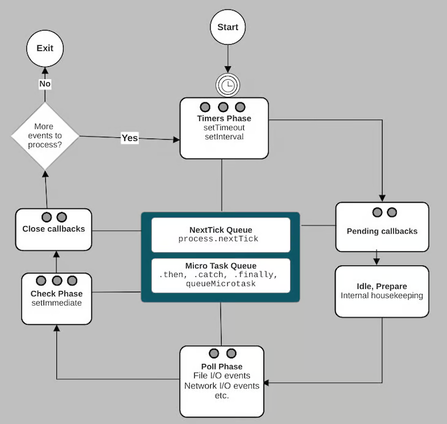

# NodeJS

NodeJS là một Framework chạy trên Google Chrome V8 Javascript Engine, dùng để phát triển ứng dụng có thể chạy Javascript ở cả Client và Server. NodeJS là một **môi trường thực thi JS** mã nguồn mở và đa nền tảng. 
- **V8** *là một Javascript Engine được sử dụng cho **Google Chrome**, dùng để thực thi JS, và điểm đặc biệt là nó tách rời với Browser (Browser sẽ triển khai thêm DOM và Web Platform APIs). Engine này hiện nay được sử dụng phổ biến cho các ứng dụng NodeJS. Ngoài ra có một số JS Engines khác như: **SpiderMonkey** (Firefox), **JavaScriptCore/Nitro** (Safari),... Tất cả các JS Engine đều triển khai theo chuẩn ECMAScript.*
- *V8 được viết bằng C++, có thể triển khai và chạy trên đa nền tảng.*
- Javascript ban đầu là một ngôn ngữ thông dịch, nhưng có một số thay đổi biến nó thành một ngôn ngữ biên dịch, với mục tiêu nhằm tăng tốc thực thi. *Phiên bản compiler đầu tiên cho JS compiler được giới thiệu vào năm 2009 trong **SpiderMonkey** Engine.* V8 cũng thực hiện compile JS với JIT (just-in-time compilation)

Một ứng dụng NodeJS chạy trên một tiến trình riêng, cung cấp **một tập các lời gọi vào ra bất đồng bộ**, không cần tạo luồng mới cho từng requests và việc truy cập vào ra cũng không bị chặn dừng. NodeJS khắc phục được nhược điểm của AJAX khi mà số lượng request tới Server là quá lớn.

Cả Browser và NodeJS đều sử dụng Javascript. Tuy nhiên, xây dựng một ứng dụng NodeJS khác hoàn toàn với tạo một ứng dụng chạy trên Browser. (1) *Trên Browser, hầu hết các tác vụ của JS là liên quan đến **tương tác với DOM và các Web Platform APIs** (như Cookies); và các chức năng này không có trên NodeJS. Ngược lại, phía NodeJS cung cấp một số chức năng như **truy xuất hệ thống tệp**, điều mà JS trên Browser không hỗ trợ.* (2) *Có thể lựa chọn ngay phiên bản JS mới nhất cho ứng dụng NodeJS nhưng một ứng dụng trên Browser lại cần phải xem xét việc tương thích với các phiên bản của Browsers, đặc biệt là quá trình nâng cấp phiên bản ES.*

Download NodeJS: https://nodejs.org/en/

## Kiến trúc

NodeJS là sự kết hợp của **Chrome's V8 JS Engine**, **Event Loop** và **IO API**.


Trong mô hình truyền thống (như Apache, Ruby Puma), các web servers dành một luồng riêng để xử lý mỗi request. Còn NodeJS được xây dựng theo kiến trúc **đơn luồng hướng sự kiện**. Cả ứng dụng web chỉ chạy trên một tiến trình, ở đó:
- Tất cả các requests được xử lý trên cùng một luồng (Single Thread)
- Tất cả các thao tác vào ra sẽ được xử lý bất đồng bộ.

Hướng thiết kế này được kế thừa từ đặc điểm của việc thực thi chương trình trên Browser: các Browser được thiết kế để thích ứng các tương tác của người dùng (ví dụ: `onClick`), NodeJS kế thừa và mở rộng điều đó với các chức năng tương tác với files, networks,...

Ứng dụng NodeJS chỉ sử dụng một số ít luồng trong hệ thống, bao gồm:
- Một luồng cho Event Loop - xử lý các yêu cầu **non-blocking I/O** cũng như các **callbacks** (khi hoàn thành). 
- Mỗi luồng cho mỗi Workers - thực thi các công việc phức tạp hơn (sử dụng C++) như **blocking I/O**.

### Event Loop

NodeJS coi các thao tác vào ra là nút thắt cổ chai chính (bottleneck) và **Event Loop** hỗ trợ để thực thi chúng ở chế độ bất đồng bộ (non-blocking).

Event Loop trong NodeJS được triển khai nhờ thư viện [**libuv**](https://libuv.org/), một thư viện đa nền tảng viết bằng C, **nằm ngoài V8 Engine**. Thư viện này làm Event Loop trong NodeJS được triển khai khác với Event Loop trên Browsers.

#### Thực thi đồng bộ và Thực thi bất đồng bộ

Trong NodeJS, V8 Engine sẽ đảm nhiệm thực thi chương trình JS, nó duy trì và quản lý **Memory Heap** (chứa dữ liệu) và **Call Stack** (chứa các lời gọi hàm). 
- Các lời gọi hàm sẽ lần lượt được đẩy vào Call Stack để **thực thi đồng bộ**, và được đẩy ra khi hoàn thành.
- Khi một lời gọi hàm cần xử lý bất đồng bộ, **libuv** sẽ đảm nhiệm việc thực thi nó, nó cũng sẽ bị đẩy ra khỏi Call Stack. libuv sẽ cố gắng tận dụng cơ chế không chặn dừng mà OS hỗ trợ (ví dụ khi xử lý network requests), hoặc nếu không (như khi đọc file), nó sẽ tạo thread pool để không thực thi trên thread chính.
- Khi xử lý bất đồng bộ hoàn thành, **callback** của lời gọi bất đồng bộ sẽ được đẩy vào Call Stack để thực thi.

> *Nếu như khi lời gọi bất đồng bộ hoàn thành và các lời gọi đồng bộ vẫn chưa được thực thi xong, thời điểm nào NodeJS sẽ thực thi callbacks?*
- Chỉ khi toàn bộ chương trình **đã được thực thi** (thực thi đồng bộ) thì Event Loop mới bắt đầu. VD trong đoạn code sau đây, mặc dù `setTimeout` chỉ cần 1s để hoàn thành nhưng phải sau 4s (khi đã thực thi đồng bộ xong vòng lặp `while` ở chương trình chính), callback của nó mới được thực thi.

```js
// set function to be called after 1 second
setTimeout(function() {
   console.log('Timeout ran at ' + new Date().toTimeString());
}, 1000);

// store the start time
var start = new Date();
console.log('Enter loop at: '+start.toTimeString());

// run a loop for 4 seconds
var i = 0;
while(new Date().getTime() < start.getTime() + 4000) {
   i++;
}
console.log('Exit loop at: ' + new Date().toTimeString()
            +'. Ran ' + i + ' iterations.');
```

#### Hiểu về polling

Trong UNIX, việc tương tác với các thiết bị đều được coi như tương tác với file, một tiến trình khi muốn thực hiện vào ra thì cần sử dụng một cấu trúc gọi là **file descriptor**, kernel sẽ sử dụng thông tin này để xác định thiết bị cần tương tác vào ra.

Tuy nhiên, tùy vào bản chất của **file descriptor** mà kernel có thể triển khai theo hướng:
- (1) **fast file** (các thiết bị có thể dự đoán ngay kết quả của thao tác, ví dụ tệp tin): thực hiện một thao tác đầy đủ và trả về kết quả hay lỗi
  - Ví dụ đọc 500 bytes từ một tệp 1000 bytes sẽ trả về 500 bytes, từ một tệp 100 bytes sẽ trả về 100 bytes, từ một tệp rỗng sẽ trả về 0 bytes.
- (2) **slow file** (các thiết bị không thể dự đoán ngay kết quả của thao tác, ví dụ socket, pipe, terminal): trả về kết quả ngay khi có thể
  - Ví dụ, yêu cầu đọc 50 bytes trong socket trong khi socket đang chỉ chứa 5 bytes thì trả về ngay 5 bytes, nếu socket không có dữ liệu thì sẽ đợi đến khi có.
  - Ví dụ, yêu cầu ghi 50 bytes khi pipe buffer chỉ còn đủ chỗ cho 10 bytes thì sẽ chỉ ghi 10 bytes, nếu pipe buffer đã đầy thì sẽ đợi đến khi còn chỗ trống.

Mặc định, các **slow file** đều hoạt động ở chế độ blocking, tức là kernel luôn cần đợi đến khi có thể đọc/ghi. Ta có thể chuyển sang chế độ non-blocking theo hai cách:
- Mở file ở chế độ non-blocking với flag `O_NONBLOCK`
- Chuyển file (đã mở) sang chế độ non-blocking với hàm `fcntl()`

> Các thao tác trên fast file có thể là blocking, tuy nhiên, thời gian blocking chỉ là thời gian để đọc/ghi toàn bộ dữ liệu yêu cầu (thread chính sẽ được đẩy vào chế độ **non-interruptible sleep**) bởi vì **khi kernel rảnh, nó có thể đọc/ghi ngay**. 
> Do đó mà các **thao tác trên fast file không thể chuyển về chế độ non-blocking**. 
> Giải pháp có thể là sử dụng đa luồng hoặc chia nhỏ dữ liệu (batching).

Thao tác với (slow) file ở chế độ non-blocking giúp "thử" đọc/ghi file và kết thúc ngay lập tức mà không chặn dừng chương trình. Tuy nhiên, để thao tác đọc/ghi này hoàn thành (như mong muốn, tức là phải đọc/ghi được dữ liệu) thì chương trình vẫn cần chọn một thời điểm thích hợp để "thử" (ví dụ như thực hiện xong các tác vụ cần xử lý đồng bộ). 

Việc "thử" này được gọi là **polling**, và vì bản chất của slow files là không thể dự đoán trước trạng thái sẵn sàng đọc/ghi nên việc polling cũng cần thực hiện liên tục.

Mô hình đơn giản của polling là dùng vòng lặp. Ví dụ dưới đây dùng vòng lặp để liên tục polling vào mảng các file descriptors để đọc dữ liệu:

```c
// convert file descriptors to non-blocking
for(int i = 0; i < nfds; i++){
  fcntl(fds[i], F_SETFL, O_NONBLOCK);
}

while (1) {
  for(int i = 0; i < nfds; i++){
    char buf[1024];
    // read in non-blocking mode === polling
    int n = read(fds[i], buf, sizeof(buf));
    if (n > 0) {
      process_data(buf, n);
    } else if (n < 0) {
      if (errno == EAGAIN || errno == EWOULDBLOCK) {
        continue;
      } else {
        handle_error();
      }
    }
  }
}
```

Có thể thấy hạn chế của cách này là tiêu tốn CPU khi dữ liệu đến rất chậm, tức là thời gian của CPU lãng phí rất nhiều chỉ để lặp (**busy waiting**).

Các OS có cách triển khai hiệu quả hơn cho việc polling thông qua `select()` và `poll()` (phiên bản mới hơn và khắc phục nhiều hạn chế của `select()`). Hai lời gọi hệ thống này cho phép kiểm tra trạng thái sẵn sàng đọc/ghi đối với một tập các file descriptor. Chúng cho phép thực hiện polling ở chế độ chặn dừng cho đến khi có bất kỳ file descriptors nào sẵn sàng, hoặc có thể xác định thời hạn cứng (timeout) cho việc polling.

```c
while (1) {
  // pre polling:
  // - set interested file descriptors to `fd_set readfds` with FD_ZERO and FD_SET and largest file descriptor value to `max_fd`
    
  // polling: block until have any ready fd
  int activity = select(max_fd + 1, &readfds, NULL, NULL, NULL);

  // error (-1)
  if (activity < 0) {
    break;
  }

  // after polling: check which fds are ready
  for (int i = 0; i < nfds; i++) {
    if (FD_ISSET(fds[i], &readfds)) {
      char buf[1024];
      // read in blocking mode, but not block
      int n = read(conns[i], buf, sizeof(buf));
      if (n > 0) {
        process_data(buf, n);
      } else if (n == 0) {
        close(fds[i]);
      } else {
        handle_error();
      }
    }
  }
}
```

Cách này sẽ chỉ thực hiện block khi mà không có bất kỳ file descriptors nào sẵn sàng. Tuy nhiên, hạn chế của `select` và `poll` là kernel luôn cần phải duyệt qua danh sách file descriptors để biết cái nào đang sẵn sàng (stateless).

`epoll` (Linux) và `kqueue` (BSD) là phiên bản hiệu quả hơn khi tạo riêng một file descriptor để có thể lưu lại trạng thái của các file descriptors cần polling, từ đó có thể chia sẻ cũng như có thể quản lý số lượng lớn file descriptors.

#### Hiểu về libuv

**libuv** là thư viện giúp triển khai cơ chế bất đồng bộ **hướng sự kiện** cho các thao tác vào ra (event-driven asynchronous I/O) trên đa nền tảng, vốn được viết để hỗ trợ cho NodeJS.

Mô hình xử lý bất đồng bộ truyền thống là sử dụng đa luồng. **libuv** triển khai theo hướng sự kiện. Ví dụ, việc đọc dữ liệu trên một socket là chặn dừng, ta có thể tạo luồng riêng để lắng nghe việc gửi dữ liệu từ đầu bên kia, và khởi tạo một luồng khác để xử lý dữ liệu nhận được. Với sự hỗ trợ của hệ thống thông báo sự kiện trong các OS hiện đại, ta có thể triển khai theo hướng
- Đăng ký với OS một sự kiện nhận dữ liệu trên một socket. Sau đó đi thực hiện các tác vụ khác. 
- Đến một thời điểm phù hợp, kiểm tra thông báo từ OS về sự kiện đã đăng ký. Nếu có thông báo, trích xuất dữ liệu từ nó (một event object) và xử lý

**libuv** là bộ thư viện giúp gom (quản lý tập trung) các sự kiện mà OS (hay các nguồn khác) phát ra và sẽ thực thi các callbacks được đăng ký khi sự kiện tương ứng xảy ra:

```
while there are still events to process:
    e = get the next event
    if there is a callback associated with e:
        call the callback
```

libuv sử dụng hai khái niệm biểu diễn các đối tượng có thể tương tác:
- **handle**: các đối tượng có vòng đời dài, ví dụ `uv_timer_t` là handle biểu diễn bộ đếm, `uv_tcp_t` là handle biểu diễn kết nối TCP (phía server).
  - Có các handles thuộc nhóm I/O (có thể thực hiện read/write), chúng bao đóng các file descriptors và có thể nhận các requests.
  - Có các handles thực hiện một số chức năng nhất định trong suốt event loop. VD: một **check** handles dùng để luôn thực thi một nhiệm vụ (callbacks) ngay sau khi polling.
- **request**: các thao tác vào ra (read/write), chúng có vòng đời ngắn, ví dụ `uv_getaddrinfo_t` là request phân giải DNS, `uv_udp_send_t` là request ghi dữ liệu trên một UDP socket.

I/O Loop (hay Event Loop) là trung tâm của thư viện này, nó được thiết kế để chạy trên một luồng độc lập.


- Bắt đầu vòng lặp, libuv cache "thời gian hiện tại" (phục vụ cho việc kiểm tra thời gian cho các tác vụ bộ đếm - timers)
- Thực thi callbacks cho các timers (`uv_timer_t`) đã hết hạn (so với "thời gian hiện tại" cache ở đầu vòng lặp)
  - Khi đang thực thi các callbacks mà có các timers hết hạn thì callbacks của chúng không được thực thi, phải đợi đến vòng lặp tiếp theo
- Sau đó là kiểm tra trạng thái của vòng lặp. Một vòng lặp đang sống ("alive") khi mà có các handles và requests đang hoạt động (hoặc tham chiếu) hoặc các handles chờ đóng.
- Thực thi callbacks pending từ vòng lặp trước.
- Thực thi callbacks cho các handles thuộc nhóm **idle** và **prepare**. (`uv_idle_t` và `uv_prepare_t`)
- Tiếp theo là trung tâm của vòng lặp - **polling** cho các I/O handles
  - Đầu tiên là xác định thời gian chờ tới hạn (timeout) - là khoảng thời gian mà vòng lặp sẽ chặn dừng để thực hiện polling. Khoảng thời gian chờ này được xác định theo một số quy tắc
    - Là 0 nếu bật flag `UV_RUN_NOWAIT`, hoặc nếu có lệnh dừng lặp, hoặc nếu không có handles hay requests nào hoạt động, hoặc nếu có bất kỳ idle handle nào hoạt động, hoặc nếu có bất kỳ handles nào chuẩn bị đóng.
    - Nếu không rơi vào bất kỳ trường hợp đặc biệt trên thì sẽ đợi vừa đủ đến khi có một timer nào đó hết hạn
    - Còn không thì sẽ đợi mãi.
  - Sau khi xác định được timeout, vòng lặp tiến vào trạng thái chặn dừng để polling.
  - Ngay sau đó sẽ thực thi các callbacks cho các I/O handles nếu có sự kiện xảy ra trên chúng.
  - Tuy nhiên, callbacks của một số I/O handles sẽ bị pending đến vòng lặp sau mới thực thi (ở pha pending)
- Ngay sau khi hoàn thành pha polling, callbacks của các handles thuộc nhóm **check** (`uv_check_t`) sẽ được thực thi
- Cuối cùng là thực thi callbacks truyền cho `uv_close` (hàm để kết thúc handle, đã được gọi trước đây, nhưng callbacks sẽ chỉ được gọi ở thời điểm này)


- Với Network I/O, **libuv** sẽ tận dụng cơ chế không chặn dừng mà OS hỗ trợ, như **epoll** (Linux), **kqueue** (OSX, BSD), **IOCP** (Windows), **event ports** (SunOS). 
- Với File I/O, **libuv** sử dụng **thread pool** để chạy (blocking) các thao tác vào ra và gửi thông báo tới thread chính khi hoàn thành, biến chúng thành không chặn dừng đối với thread chính.
- Ngoài ra, thread pool cũng được dùng đối với các hàm DNS như `getaddrinfo` và `getnameinfo`, tạo nên phiên bản bất đồng bộ của chúng. 
- **libuv** cũng hỗ trợ tận dụng thread pool để người dùng sử dụng cho các tác vụ nặng, cần xử lý không chặn dừng trên luồng khác (`uv_queue_work`)

#### Event Loop trong NodeJS

Khi NodeJS bắt đầu, nó (1) khởi tạo Event Loop, (2) thực thi đồng bộ chương trình chính (script đầu vào) và (3) bắt đầu xử lý Event Loop, với các pha (phases) như sau:



Các pha này tương ứng với libuv event loop, được triển khai theo các chức năng của NodeJS. Cụ thể:

- Pha **Timers** là thời điểm thực thi cho callbacks của các bộ đếm quá hạn (`setTimeout` và `setInterval`)
- Pha **Idle/Prepare** được dùng nội bộ cho việc dọn dẹp (không liên quan và ảnh hưởng đến cách thức thực thi chương trình)
- Pha **Check** là thời điểm thực thi cho callbacks của `setImmediate`
- Pha **Close** là thời điểm thực thi cho callbacks của các events dạng "close" (readableStream, socket)

Không kể đến pha **Idle/Prepare**, tất cả các pha của Event Loop đều có một queue để chứa danh sách các callbacks sẽ được thực thi khi Event Loop tiến vào pha đó. Các queue này sẽ được thêm phần tử khi:
- Khi thực thi chương trình chính, callbacks của các lời gọi bất đồng bộ sẽ được libuv chuyển vào queue tương ứng
- Trong quá trình thực thi các callbacks, nếu tiếp tục có các lời gọi bất đồng bộ thì libuv chuyển vào queue tương ứng. **Chú ý**: *việc thực thi callback cũng là **thực thi đồng bộ** (với V8 Engine)*.

Trung tâm của Event Loop là pha **Poll**, ở mỗi vòng lặp, khi tiến vào pha này, cách xử lý sẽ như sau:
- Nếu không có bất kỳ timers nào
  - Nếu **Poll** queue có callbacks, nó sẽ thực thi toàn bộ chúng và dừng lại giữa chừng nếu như số callbacks vượt quá ngưỡng cho phép của hệ thống
  - Khi **Poll** queue trống. 
    - Khi **Check** queue có callbacks thì sẽ kết thúc pha này và chuyển sang pha **Check**.
    - Khi **Check** queue trống, tiếp tục Polling cho đến khi có thao tác I/O hoàn thành

Ở pha Polling, **khi Poll queue trống, NodeJS lựa chọn ưu tiên thực thi pha Check (nếu có callbacks) hơn là Polling**


Tham khảo:
- https://blog.logrocket.com/complete-guide-node-js-event-loop/
- https://www.builder.io/blog/visualizing-nodejs-close-queue
- https://medium.com/preezma/node-js-event-loop-architecture-go-deeper-node-core-c96b4cec7aa4
- https://viblo.asia/p/understand-nodejs-YWOZrenrKQ0
- https://www.linuxtoday.com/blog/blocking-and-non-blocking-i-0/
- https://www.remlab.net/op/nonblock.shtml
- https://tuhuynh.com/posts/nio-under-the-hood/
