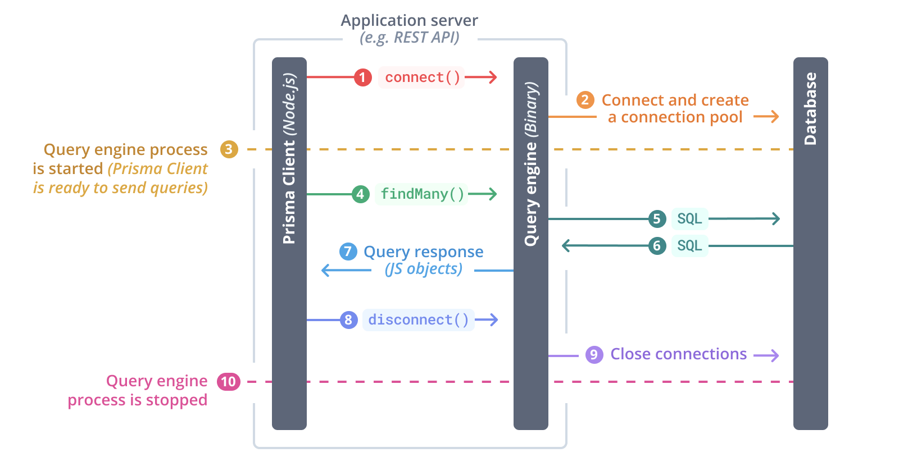

# Prisma

Prisma là một thư viện ORM mã nguồn mở cho NodeJS và TypeScript, thiết kế theo hướng **schema-first** (giống như GraphQL), tức là chỉ cần định nghĩa ORM schema, thư viện có thể sinh cả database migrations, models và queries API.

Prisma schema sử dụng một ngôn ngữ hướng khai báo riêng, được đặt tên là *Prisma Schema Language* (**PSL**), cho phép khai báo:
- Cấu hình để kết nối Database
- Cấu hình để sinh **Prisma Client** hoặc các tài nguyên khác từ Schema
- Cấu trúc Models

Schema là trung tâm của Prisma, kết nối giữa ứng dụng (các truy vấn ở mức cao) và databases (SQL). Nhìn từ Schema, có hai hướng tiếp cận khi sử dụng Prisma:
- Khai báo cấu trúc Models trong schema và tạo database migration sử dụng **Primsa Migrate**
- Sử dụng **Introspection** để tạo cấu trúc Models từ database.

Sau khi có Schema thì có thể tạo **Prisma Client** để tạo các truy vấn và thay đổi database với cú pháp của JS (hoặc TS).

## So sánh với các thư viện khác

Prisma là thư viện có mức abstraction cao, của một ORM. Trong khi [**knex.js**](https://knexjs.org/) lại hướng đến là một Query Builder (tránh phải viết SQL nhưng vẫn cần tư duy theo SQL)

Các ORMs truyền thống (như [**Sequelize**](https://sequelize.org/)) thiết kế theo hướng khai báo Models qua các Classes và ánh xạ chúng tới Database Tables. Việc ánh xạ này có thể dẫn tới [**object-relational impedance mismatch**](https://en.wikipedia.org/wiki/Object-relational_impedance_mismatch), mà một ví dụ của nó là **N+1 Query**.

Prisma, một ORM, nhưng được trang bị (và hướng tới cải thiện) khả năng tối ưu câu truy vấn và bộ công cụ sinh tự động, cho phép đạt được năng suất cao hơn so với các ORMs truyền thống.

Tất nhiên, hạn chế của nó là ít khả năng tùy chỉnh hóa và không đảm bảo câu truy vấn là tối ưu với mọi trường hợp.

## Prisma Client

Prisma Client là một thư viện (tự động sinh) giúp ứng dụng có thể tương tác với database với cú pháp của JS/TS.

Prisma Client bao gồm 3 phần chính là JS client library + TS type definitions + **Query engine**.

**Query engine** là một chương trình được triển khai bằng **Rust**, và kết quả compile của nó thì phụ thuộc vào platform. 

> Đó là lý do khi cấu hình cho Prisma Client cũng cần cân nhắc platform cho query engine
> Có thể chỉ định danh sách qua [`binaryTargets`](https://www.prisma.io/docs/orm/reference/prisma-schema-reference#binarytargets-options)
> Khi cấu hình sử dụng một query engine cho Prisma Client, chương trình của nó sẽ được tải về vào thư mục `node_modules/@prisma/engines` và được sao chép vào thư mục kết quả của Prisma Client (nơi chứa JS/TS APIs)

Query engine là cầu nối (API) giữa Prisma Client và databases. Có hai cách thức mà Prisma Client kết nối Query engine (`engineType`):
- `library` nạp engine như một Node-API
- `binary` chạy engine như một process phụ và sử dụng tương tác giữa hai processes



> Query engine thực hiện khởi tạo và quản lý connection pool
> Mọi yêu cầu từ ứng dụng tới database đều đi qua query engine.

## Cấu hình

### Data Source

Giúp cấu hình cho kết nối tới một database cho ứng dụng, bao gồm driver (`provider`) và connection string (`url`).

```prisma
datasource db {
  provider = "postgresql"
  url      = env("APP_DATABASE_URL")
}
```

### Generators

Giúp cấu hình cho các bộ sinh tự động **Prisma Client** hay các tài nguyên khác từ Schema.

Có hai generators dùng để sinh Prisma Client là:
- `prisma-client-js`, sinh Prisma Client và lưu vào `node_modules/.prisma/client`
  - Yêu cầu `@prisma/client` package
- `prisma-client` là generator mới hơn:
  - API sinh ra là TS hoàn toàn
  - Có thể tùy chỉnh vị trí lưu (`output`)
  - Có thể sử dụng cú pháp ES hoặc CJS (`moduleFormat`)

Ngoài ra, có một số package giúp sinh một số tài nguyên từ Prisma Schema:
- [`prisma-erd-generator`](https://github.com/keonik/prisma-erd-generator) giúp sinh ERD
- [`prisma-generator-fake-data`](https://github.com/luisrudge/prisma-generator-fake-data) giúp sinh seed data
- [`zod-prisma`](https://github.com/CarterGrimmeisen/zod-prisma) giúp sinh Zod schemas
- [`prisma-joi-generator`](https://github.com/omar-dulaimi/prisma-joi-generator) giúp sinh Joi schemas
- [`prisma-class-generator`](https://github.com/kimjbstar/prisma-class-generator) giúp sinh Model Class
- [Xem thêm](https://www.prisma.io/docs/orm/prisma-schema/overview/generators#community-generators)

```prisma
// for generating Prisma Client
generator client {
  provider          = "prisma-client"
  output            = "../src/generated/prisma"
  moduleFormat      = "esm"
}

// for generating Zod schemas
generator zod {
  provider          = "zod-prisma"
  output            = "./zod" // (default) the directory where generated zod schemas will be saved
  modelCase         = "PascalCase"
}

// for generating ERD
generator erd {
  provider          = "prisma-erd-generator"
  output            = "../ERD.svg"
  theme             = "forest"
}
```

### Vị trí của Schema

Mặc định, tệp Schema mà Prisma tìm kiếm là `./prisma/schema.prisma` hoặc `./schema.prisma`. 

Có thể cấu hình lại qua:
- `prisma generate --schema=....`
- `"prisma": {"schema": "..."}` trong `package.json`

Ta có thể chia nhỏ Schema thành nhiều tệp và chỉ định sử dụng `previewFeatures` cho Generator. Khi đó, generator sẽ tìm kiếm các phần schema ở trong thư mục `prisma/schema/`

```prisma
// schema.prisma
generator client {
  provider        = "prisma-client-js"
  previewFeatures = ["prismaSchemaFolder"]
}
```

## Model

## CLI

|Commands|Mô tả|
|--|--|
|`prisma format`|Định dạng lại các tệp Schema|
|

# Joi
